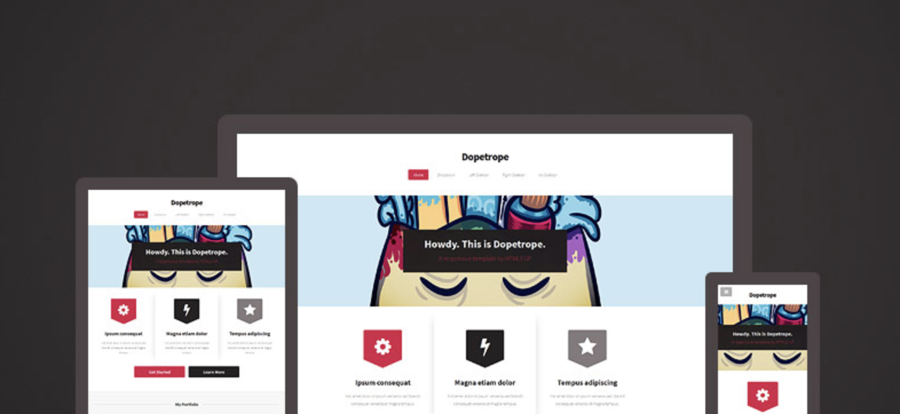

# Dopetrope

Dopetrope theme ported from [HTML5 UP](https://html5up.net/) for use with the [Hugo static site generator](https://gohugo.io/).

Theme includes ability for:

 - Portfolio items
 - Blog posts



## Setup

### Configuration

 ```
 languageCode = "en-us"
title = "My New Hugo Site"
baseURL = "http://localhost:1313/"
theme = "../.."

[params]
    subtitle = "Howdy. This is Dopetrope."
    subtitleline2 = "A responsive template by HTML5 UP"

[params.intro]
    title1 = "Ipsum consequat"
    description1 = "Nisl amet dolor sit ipsum veroeros sed blandit consequat veroeros et magna tempus."

    title2 = "Magna etiam dolor"
    description2 = "Nisl amet dolor sit ipsum veroeros sed blandit consequat veroeros et magna tempus."

    title3 = "Tempus adipiscing"
    description3 = "Nisl amet dolor sit ipsum veroeros sed blandit consequat veroeros et magna tempus."

    buttonlink1 = "#"
    buttontext1 = "Get Started"

    buttonlink2 = "#"
    buttontext2 = "Learn More"

[params.footer]
    title1 = "Blandit nisl adipiscing"

    title2 = "What's this all about?"
    imagelink2 = "#"
    imageurl2 = "images/pic10.jpg"
    description2 = "This is Dopetrope a free, fully responsive HTML5 site template by AJ for HTML5 UP It's released for free under the Creative Commons Attribution license so feel free to use it for any personal or commercial project – just don't forget to credit us!"
    buttonlink2 = "#"
    buttontext2 = "Find out more"

    title3 = "Tempus consequat"

    title4 = "Ipsum et phasellus"

    title5 = "Vitae tempor lorem"


[params.social]
    facebook = "https://facebook.com"
    twitter = "https://twitter.com/"
    dribbble = "https://dribbble.com"
    linkedin = "https://www.linkedin.com"
    googleplus = "https://plus.google.com/"

[params.address]
    line1 = "Untitled Incorporated"
    line2 = "1234 Somewhere Road Suite"
    line3 = "Nashville, TN 00000-0000"

[params.contact]
    email = "someone@untitled.tld"
    phone = "(800) 000-0000"
```

### Cover Image

The cover image URL is hard-coded, therefore to replace this add an image to the following location in your Hugo application:

```
/static/images/pic01.jpg
```

## Original Theme Credits

 - [Dopetrope by HTML5 UP](https://html5up.net/dopetrope)

## License

This hugo theme is licensed under the [Creative Commons Attribution 3.0 License](https://creativecommons.org/licenses/by/3.0/). 

Read More - [LICENSE.md](LICENSE.md)